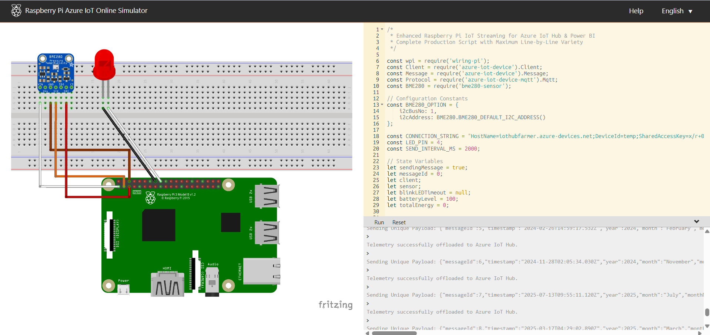
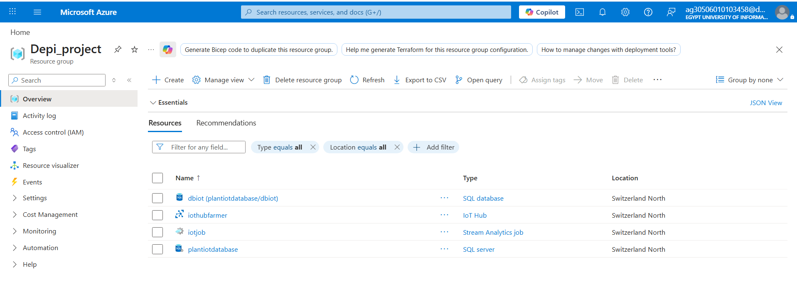
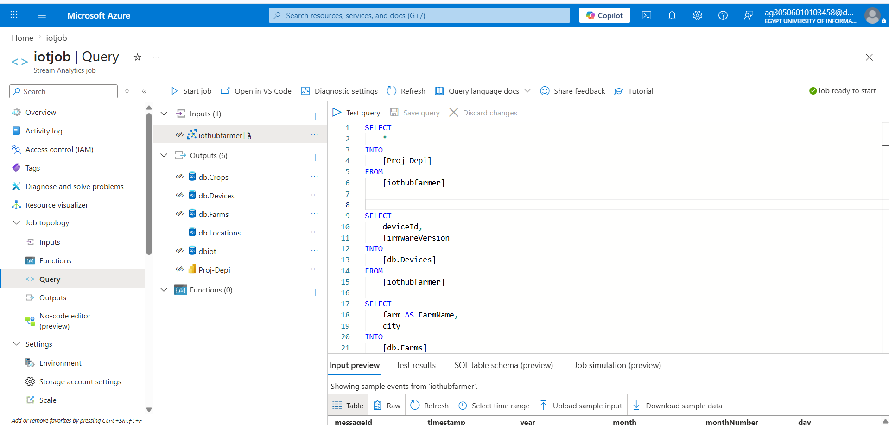
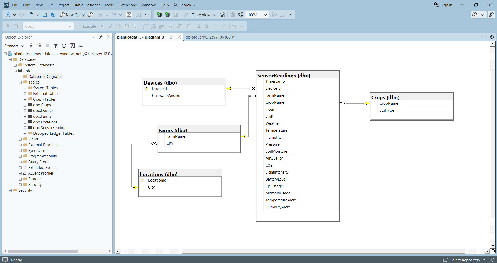
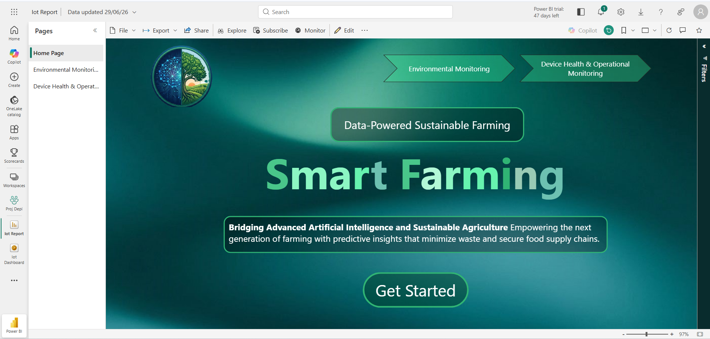
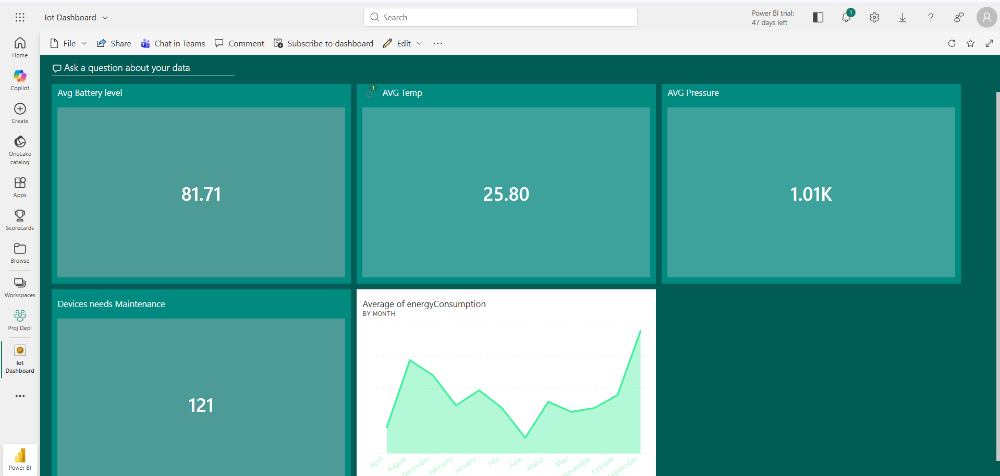
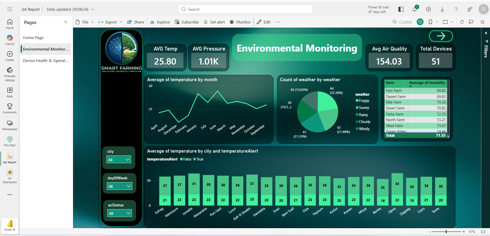
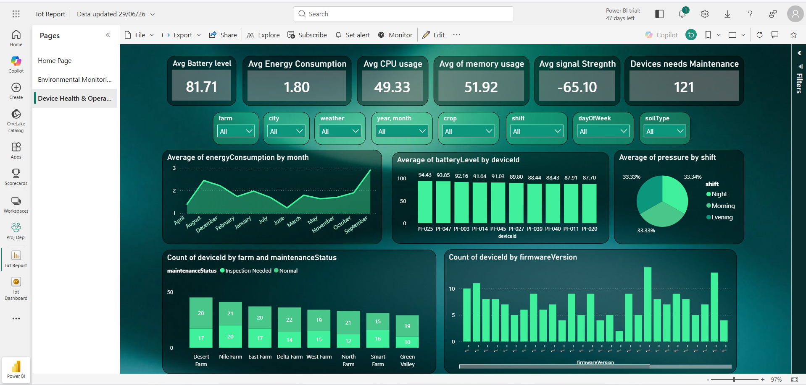

# Farmland: Data-Powered Sustainable Farming 🌾

## Project Overview
**Farmland** is an end-to-end, real-time IoT and Data Analytics platform designed to empower sustainable agriculture. Developed to bridge advanced artificial intelligence and sustainable farming, this project leverages Microsoft Azure cloud services to ingest, process, and visualize agricultural telemetry. 

The platform continuously monitors both environmental conditions (temperature, humidity, air quality) and IoT device health (battery levels, CPU usage, maintenance status), providing actionable predictive insights that minimize waste and secure food supply chains.

## Technologies Used
* **IoT & Edge:** Raspberry Pi (Azure IoT Simulator), Node.js, MQTT, BME280 Sensor
* **Cloud Ingestion:** Azure IoT Hub
* **Real-Time Processing:** Azure Stream Analytics
* **Data Storage:** Azure SQL Server & Database
* **Business Intelligence:** Microsoft Power BI
* **Deployment:** Azure Resource Manager

---

## System Components & Visual Showcase

### 1. IoT Simulation & Telemetry Ingestion

**Description:** To simulate edge-device data collection, we utilized the Raspberry Pi Azure IoT Online Simulator. The setup mimics a physical BME280 sensor connected to a Raspberry Pi. A custom Node.js script is deployed to read environmental states and stream JSON-formatted telemetry payloads directly to our Azure IoT Hub in real-time.

### 2. Azure Cloud Infrastructure & Stream Processing

**Description:** Our cloud backbone is deployed within an Azure Resource Group (`Depi_project`). It consists of an **IoT Hub** (`iothubfarmer`) for massive telemetry ingestion and an **Azure SQL Server** (`plantiotdatabase`) for persistent storage. 
To connect the two, we configured an **Azure Stream Analytics job** (`iotjob`). The job uses SQL-like query language to filter, transform, and route the incoming IoT telemetry streams into designated normalized tables (e.g., `[db.Devices]`, `[db.Farms]`) within our SQL database with sub-second latency.

### 3. Relational Database Architecture (Azure SQL)

**Description:** The processed data is stored in a robust relational database schema optimized for analytics. The schema links a central `SensorReadings` fact table (containing granular data like Humidity, Pressure, Co2, and CPU Usage) with dimensional tables including `Devices`, `Farms`, `Locations`, and `Crops`. This relational model allows for complex analytical queries and ensures data integrity across different farming sectors.

### 4. Power BI Analytics & Dashboards
To translate raw data into actionable insights, we built a comprehensive Power BI reporting suite containing two primary modules:

#### Home Page & Top-Level Dashboard

**Description:** The entry point to our BI solution, providing a clean, navigable interface to explore both environmental and operational metrics.

#### Environmental Monitoring

**Description:** This dashboard focuses on agronomic conditions. It tracks real-time averages for Temperature, Pressure, and Air Quality. Features include a line chart tracking temperature trends across months, a breakdown of weather distributions (Sunny, Foggy, Rainy), and granular temperature alerts aggregated by city, allowing farmers to react to adverse weather instantly.

#### Device Health & Operational Monitoring

**Description:** Crucial for maintaining the IoT fleet, this dashboard monitors the hardware status across all farms. It provides insights into Average Battery Level, Energy Consumption, CPU/Memory usage, and Signal Strength. A dedicated metric highlights the exact number of devices requiring maintenance, segmented by farm locations (e.g., Desert Farm, Nile Farm), ensuring zero downtime in the data pipeline.

---

## Team Members
* **Ahmed Khalid Mohammed Hafez**
* **Ahmed Mohammed Ali Gheith**
* **Abdallah Mahmoud Mahmoud Hassan**
* **Mohammed Ezzat Abdelaziz Eltayeb**
* **Mohammed Hatem Waheed Eldin Ata**
* **Mina Magdy Boshra Fahim**
